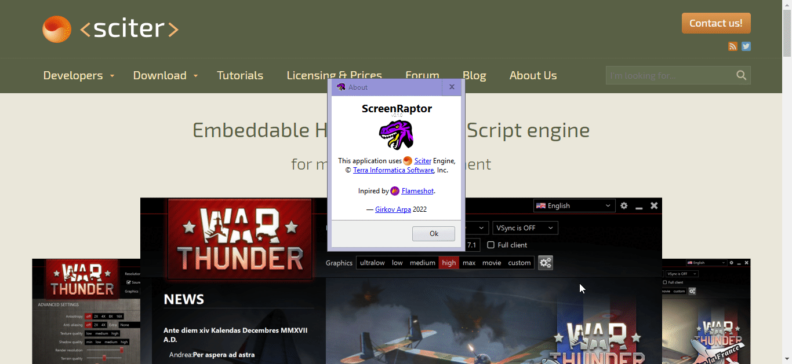

<h1 align="center">
  <a href="https://github.com/girkovarpa/screenraptor">
    
    
ScreenRaptor

  </a>
</h1>

<h2 align="center">Simple, intuitive screenshotting.</h2>
<h5 align="center"><i>Inspired by <a href="https://github.com/flameshot-org/flameshot">Flameshot</a></i></h5>

<h1 align="center">
  </a>  
</h1>
